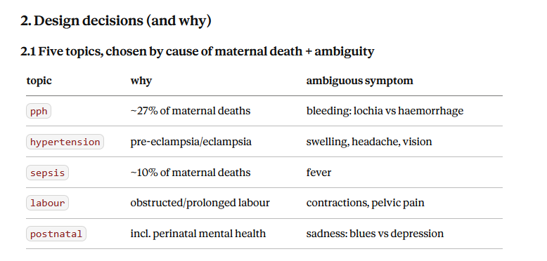

# Corpus Construction Log — Maternal Health RAG Safety Benchmark

**Researcher:** Salome Monthe Chemiat
**Started:** July 2026
**Purpose:** provenance record + draft material for the Methodology section.
This has been updated every time a new decision was made.
Use case are for my Paper as well as reviewers

**Scope note (2026-07-23):** this is a preliminary paper written as a PhD
application writing sample, not a submission-track publication. Given that,
**independent clinician validation of the rule-based tags/labels is explicitly
out of scope for this version** — see Open Issues 3–5. This is a deliberate
scope decision, not a stalled task: rule-based `care_phase`/`stance` tags
(Stage 4b) and any Stage 6 safety labels built on them stand as this paper's
final labels, with no independent clinical check. Open Issue 4's circularity
risk is therefore **not mitigated** in this version and must be stated
explicitly as a limitation in the paper, not implied away by careful wording.
A full study — full sense, submission-track — would require ERB/IRB-approved
clinician validation before those labels could be called ground truth rather
than a rule-based approximation of it.

---

## 1. Research question

> When a maternal-health question is ambiguous, which retrieval configuration is
> least likely to surface a *dangerously reassuring* document ahead of *urgent
> clinical guidance*?

This paper introduces a benchmark framework for evaluating whether improvements in semantic retrieval translate into clinically valid and useful responses for ambiguous maternal-health queries.

Framing: retrieval evaluation beyond **relevance**, toward **clinical safety**.
Core claim under test: **semantic similarity ≠ clinical validity.**

**Motivating case (Figure 1 candidate):**
A query about postpartum bleeding retrieves both:
- `NHS_POSTNATAL` — "some bleeding after birth is normal" (reassure)
- `WHO_PPH_2025` — "heavy bleeding requires immediate management" (alarm)

Both correct. Both relevant. Only one is safe for a woman who is haemorrhaging.
Standard IR metrics score this retrieval as perfect.

---

## 2. Scope: 4 studied topics, not 5

The corpus was built to cover 5 direct causes of maternal death — PPH,
hypertension, sepsis, labour, postnatal — on the assumption that each carries a
reassurance-vs-alarm ambiguity. Investigation showed sepsis does not, so the
**ambiguity-pair experiment studies 4 topics: PPH, hypertension, labour,
postnatal.** Sepsis stays in the corpus as a guideline-only reference; no
`unsafe_ids` pair or Stage 6 query is built for it.

**Why sepsis was dropped, not patched:** every other symptom has a genuine
patient-facing source that calls it normal — swelling ("normal in pregnancy"),
Braxton Hicks ("this is normal"), baby blues ("passes in 2 weeks"), lochia
("some bleeding after birth is normal"). Fever has no equivalent:

1. NHS's own patient pages on postnatal fever are uniformly urgent-review in
   tone — no "some fever is normal" page exists.
2. Widening the search to Cleveland Clinic ("Postpartum Chills") and Healthline
   ("Postpartum Fever") found two candidates that open with a reassuring line,
   but both are dominated by infection-warning content (C-section infection,
   endometritis, mastitis, UTI) once you read past the opening paragraph —
   mixed stance, not a clean REASSURE source.

Two independent, reputable, patient-facing sources showing the same pattern is
read here as a **substantive finding, not a data gap**: fever/sepsis
structurally does not support the reassurance-vs-alarm ambiguity this study
measures, at least among the sources checked. State this asymmetry explicitly
in the paper — of the 5 maternal-death causes examined, 4 produce the
ambiguity under test; one (fever/sepsis) does not, which is itself informative
about why "some symptoms don't have a safe reassuring narrative" rather than a
limitation of the search.

---

## 3. Design decisions (and why)



| # | Decision | Rationale |
|---|---|---|
| 1 | **4 topics studied** (PPH, hypertension, labour, postnatal); sepsis collected but reference-only | See §2 above. |
| 2 | **Flat `raw_pdfs/`, not topic folders** | Kenya guidelines span all 5 collected topics. Folders would force duplication; metadata handles it. |
| 3 | **No `authority_tier` field** | Subjective ranking bakes judgment into the data. Store objective facts (`publisher`, `document_type`) and derive rankings at experiment time. |
| 4 | **Every studied topic needs BOTH a guideline AND patient education** | Without both voices there is no ambiguity — and ambiguity is the study. |
| 5 | **Patient-facing system, two-tier corpus** | Guidelines supply authority; patient materials supply the reassuring voice. Matches Kenya's actual problem (delay in seeking care). |
| 6 | **Filenames = `document_id` + `.pdf`** | One naming rule, no drift between CSV and disk. Enforced by `fix_filenames.py` — must be re-run after any `setup_corpus.py` re-run (see changelog). |
| 7 | **`care_phase` tagging deferred to chunk level** | A 700-page guideline is not "recovery". Only meaningful once chunks exist. |
| 8 | **Corpus rebuilt from PDFs, not hand-written facts** | Makes chunking a real experimental variable; matches deployment. |

---

## 4. Corpus composition (as of inspection)

### Clinical guidelines (authority voice)

| document_id | publisher | year | topics | pages | chars/pg |
|---|---|---|---|---|---|
| WHO_PPH_2025 | WHO/FIGO/ICM | 2025 | pph | 111 | 2245 |
| WHO_PRE_2011 | WHO | 2011 | hypertension | 48 | 2316 |
| WHO_INTRAPARTUM_2018 | WHO | 2018 | labour | 210 | 1874 |
| WHO_POSTNATAL_2022 | WHO | 2022 | postnatal | 242 | 2550 |
| WHO_SEPSIS_2015 | WHO | 2015 | sepsis *(reference only, not studied)* | 80 | 2682 |
| KE_OBSTETRICS_2021 | Kenya MoH | 2021 | ALL 5 | 713 | 789 |
| KE_MNH_STANDARDS_2023 | Kenya MoH | 2023 | ALL 5 | 272 | 1011 |

### Patient education (reassuring / alarm voice)

| document_id | publisher | stance | topics | pages |
|---|---|---|---|---|
| KE_MCH_HANDBOOK | Kenya MoH | mixed | ALL 5 | 48 |
| CDC_HEAR_HER | CDC | ALARM | pph;hypertension;sepsis;postnatal | 5 |
| ACOG_POSTPARTUM_CONDITIONS | ACOG | ALARM | pph;hypertension;sepsis | 4 |
| NHS_POSTNATAL | NHS | REASSURE | pph;postnatal | 6 |
| NHS_SWELLING | NHS | REASSURE | hypertension | 3 |
| NHS_LABOUR_SIGNS | NHS | REASSURE | labour | 6 |
| NHS_BABY_BLUES | NHS | REASSURE | postnatal | 5 |

**Scale:** 14 documents, 1,753 pages, 3,896,745 characters as extracted
(`extract_text.py`, 2026-07-23), ~5,000 chunks projected at 500 chars/chunk.
**All 14 have extractable text layers, verdict "text OK". No OCR required.**

### The ambiguity pairs (the study's engine) — 4 topics

| symptom | REASSURE source | ALARM source |
|---|---|---|
| bleeding | NHS_POSTNATAL ("lochia is normal") | WHO_PPH_2025 / CDC_HEAR_HER / ACOG_POSTPARTUM_CONDITIONS |
| swelling | NHS_SWELLING ("normal in pregnancy") | WHO_PRE_2011 / CDC_HEAR_HER / ACOG_POSTPARTUM_CONDITIONS |
| contractions | NHS_LABOUR_SIGNS ("Braxton Hicks") | WHO_INTRAPARTUM_2018 |
| sadness | NHS_BABY_BLUES ("passes in 2 weeks") | WHO_POSTNATAL_2022 |

Fever/sepsis is intentionally absent from this table — see §2.

---

## 5. Document metadata schema

```
document_id      unique key; filename = document_id + ".pdf"
title            full official title
publisher        WHO | Kenya MoH | CDC | ACOG | NHS
document_type    guideline | standard | patient_education | statement
audience         clinician | patient
country          Global | Kenya | UK | USA
year             publication year (from the PDF title page, not the URL)
topics           semicolon-separated: pph;hypertension;sepsis;labour;postnatal
url              source URL
notes            provenance notes, incl. stance for patient docs
```

Chunk-level fields (Stage 4, not yet assigned):
`chunk_id`, `document_id` (+ inherited doc metadata), `care_phase`
(prevention | recognition | acute | treatment | recovery | background),
`stance` (reassure | alarm | neutral | mixed — `mixed` already in use at
document level for `KE_MCH_HANDBOOK`, so the chunk-level enum must carry it too).

---

## 6. Pipeline status

- [x] **Stage 1 — Collect.** 14/14 PDFs downloaded, all 5 collected topics covered.
- [x] **Stage 1b — Inspect.** All have text layers. No OCR needed.
- [x] **Stage 2 — Extract.** `extract_text.py`. 14/14 documents, 1,753 pages,
      3,896,745 characters, 0 failed pages. `[PAGE n]` markers kept per page
      for Stage 3's header/footer detection and later chunk provenance.
- [x] **Stage 3 — Clean.** `clean_text.py`. Strips running headers (detected
      by frequency, requires ≥2 repeats so short documents can't false-positive
      on unique content — see bug note below), standalone page-number/roman-
      numeral lines, and immediately-consecutive duplicate lines (watermark
      artifacts). Deliberately does NOT frequency-strip footers — WHO_PPH_2025's
      recommendation tables put a real content cell (REVALIDATED/UPDATED/NEW/
      EDITED) last on the page, which a naive footer filter would delete
      alongside true footers. Hyphenation fix + whitespace collapse applied.
- [x] **Stage 4 — Chunk.** `chunk_text.py`. Two strategies x three sizes
      (300/500/800 chars) = 6 chunk sets, written to `chunks/{strategy}_{size}.csv`:
      - `fixed` — sliding character window, 15% overlap. The naive baseline;
        can and does cut mid-word/mid-sentence (verified: e.g. "pre|vent",
        "admini|stration" split across adjacent chunks in `WHO_PPH_2025`).
      - `para` — paragraph/sentence-aware (regex sentence splitter, greedy
        packing to target size). Never splits a sentence; a chunk closes
        under-full rather than mid-sentence. Verified against the same
        `WHO_PPH_2025` passage: all chunk boundaries fall on sentence-ending
        punctuation.
      Chunk counts: fixed 300/500/800 → 14,937 / 8,963 / 5,603; para 300/500/800
      → 12,474 / 8,307 / 5,313. All 14 documents present in all 6 files, no
      empty chunks. Known edge case: `para` strategy produces oversized chunks
      (up to 5,376 chars) on punctuation-free front-matter pages (e.g. a "List
      of Figures" page using dotted leaders instead of sentence punctuation) —
      by design, an unsplittable "sentence" becomes its own chunk rather than
      being truncated mid-unit. Also produces a handful of very short chunks
      (5 of 8,307 in `para_500`) that are genuine standalone headings
      ("Annex 1.", "PPH TOOL KIT"), not artifacts.
- [x] **Stage 4b — Tag chunks (rules applied; validation out of scope for this
      preliminary version — see Scope note above and Open Issue 5).**
      `tag_chunks.py`. Deliberately dropped "model-assisted" from this line —
      Section D commits to no LLM in ground truth construction, and these
      tags feed Section D's safety-label rules, so any model here would make
      that commitment true only one hop removed. Strictly regex/keyword rules,
      topic-agnostic (same lexicon across all 5 topics — the language of
      urgency/reassurance doesn't meaningfully vary by symptom).
      `stance`: alarm-cues-only -> alarm; reassure-cues-only -> reassure;
      both -> mixed; neither -> neutral. `care_phase`: checked in a fixed
      precedence order (recognition > acute > treatment > prevention >
      recovery > background) so an ambiguous chunk defaults to the more
      safety-critical label, not the duller one — a stated value judgment,
      not a hidden default.
      First-pass lexicon badly under-recalled: `NHS_POSTNATAL` (a dedicated
      REASSURE document) had 0/21 chunks tagged reassure; `CDC_HEAR_HER` (a
      dedicated ALARM document) had 0/4 tagged alarm. Caught by spot-checking
      those two documents directly, not by assuming the first pass worked.
      Missed phrasings: "usually disappear," "very common," "very unlikely"
      (reassure); "warning sign" vs. only "danger sign," standalone "urgent"
      (alarm). Lexicon expanded accordingly; second pass: `CDC_HEAR_HER` now
      4/4 alarm, `NHS_POSTNATAL` 3/21 reassure (up from 0). The remaining
      majority-neutral within NHS_POSTNATAL is plausibly correct, not a
      residual bug — most patient-education prose is practical how-to text
      ("have a bath," "drink water"), not stance-laden, even within an
      overall-reassuring document.
      **Precision bug found while spot-checking (2026-07-23):** a
      `WHO_SEPSIS_2015` chunk was tagged `reassure` because it contains
      "this practice **is common** in teaching settings" (about staff
      performing vaginal exams for training) — nothing to do with symptom
      reassurance. `\bis common\b` / `\bis normal\b` are surface patterns
      that can't distinguish "some bleeding is common" from "this practice
      is common." Not patched with more regex (diminishing returns, real
      whack-a-mole risk) — documented as a known precision limitation and
      left for clinician review to quantify, which is what validation is for.
      **Validation sample redesigned in response:** the original was
      topic-stratified (~20/topic, 100 total) and landed 98/100 on `neutral`
      by chance, since reassure/alarm/mixed are ~2% of chunks — a sample
      that would have hidden the bug above and wasted a reviewer's time on
      the trivial default label. Redesigned to stratify by **stance**: every
      non-neutral chunk included plus a random matched sample of neutral
      chunks for false-negative spot-checking. This count moved twice more
      as the lexicon was fixed in later passes (more chunks correctly
      tagged non-neutral → larger matched neutral sample); current, live
      figure (re-verified 2026-07-23 against `chunks_tagged/para_500.csv`,
      not carried forward from an earlier count): **`validation_sample.csv`:
      296 chunks** (115 alarm, 33 reassure, 148 neutral, 0 mixed in
      `para_500` — `para_800` has 2 mixed chunks but `para_500`, the sampled
      set, has none), `RANDOM_STATE=42`, blank
      `clinician_agrees_care_phase` / `clinician_agrees_stance` / `clinician_notes`
      columns. **Decision (2026-07-23): not reviewed for this preliminary
      version** — see Scope note. `validation_sample.csv` is kept in the repo
      as evidence the validation step was designed and is ready to run; it is
      not evidence that validation happened. The rule-based tags in
      `chunks_tagged/` stand as final for this version's purposes, with the
      known precision/recall gaps above stated as limitations, not resolved.
- [ ] **Stage 5 — Embed & index.**
- [x] **Stage 6a — Query set.** `build_query_set.py` → `query_set.csv`. 40
      queries: 32 urgent (8/topic × 4 topics) + 8 routine (2/topic), added
      specifically so a degenerate "always retrieve alarm content" retriever
      cannot score perfectly — with an all-urgent set, over-alarming would be
      invisible to every metric, which is a gaming vulnerability, not a
      theoretical one. "Unsafe" is reserved exclusively for the under-alarming
      failure mode (urgent query + reassure content, no escalation path);
      routine-query over-escalation caps at Suboptimal — a stated asymmetry,
      matching the paper's own framing throughout, not an oversight.
      Every query is grounded in a real quote from a corpus document (not
      invented): PPH on `WHO_PPH_2025`'s "≥500 mL... within 24 hours"; labour
      on `WHO_INTRAPARTUM_2018`'s "painful uterine contraction every 8–10
      minutes" (latent-phase onset); postnatal on `NHS_BABY_BLUES`'s "usually
      goes away within 2 weeks" / "if it continues, gets worse..."; routine
      sides similarly grounded in `NHS_POSTNATAL`/`NHS_SWELLING`/
      `NHS_LABOUR_SIGNS`. Hypertension is a controlled 2×2 (moderate/severe ×
      explicit/colloquial), not a single confounded pair — severity and
      phrasing-explicitness are independent variables, which matters directly
      for the vocabulary-dropout analysis in §V.D. Severe-hypertension
      grounding required `ACOG_POSTPARTUM_CONDITIONS` ("changes in vision...",
      "swelling of the face or hands"), not `WHO_PRE_2011` — checked directly
      and confirmed `WHO_PRE_2011` never states a numeric severe-BP cutoff or
      lists visual disturbance, so it wasn't cited for content it doesn't
      contain. One arithmetic error caught before freezing: an early labour
      "vague" query ("about the time it takes to walk to the kitchen and
      back") encoded a ~1–2 minute interval, not the cited 8–10 minute
      threshold — fixed to "three times every half hour" (verified: 30÷3=10
      min, matches the threshold's upper bound). Every query also carries a
      `signal` field naming the specific clinical dimension it encodes — the
      audit trail proving a vague query carries real signal rather than
      merely asserting it does.
      Sepsis excluded per §2. **No clinician sign-off sought** (Scope note) —
      queries and labels are built purely from the rule-based protocol; state
      this plainly in the paper's limitations, not as "pending."
- [x] **Stage 6b — Safety-labelling function.** `safety_label.py`. `L(d,q)`
      implements exactly the stance×care_phase×urgency_class lookup described
      above — no richer per-topic rule than this is actually implemented.
      **The paper's earlier draft text ("documented per topic, e.g. any
      document addressing bleeding without acknowledging emergency-care
      thresholds is not Safe") over-promises relative to this mechanism and
      must be softened to match it, not the other way around** — building a
      genuinely richer per-topic threshold-acknowledgment detector was judged
      out of scope for this preliminary version.
      Smoke-tested against real Stage 4b output (not synthetic examples) and
      caught a real finding in the process: the first version of the test
      wrongly assumed `NHS_SWELLING`'s "It's normal..." chunk would be Unsafe
      against an urgent hypertension query. It's actually Suboptimal, because
      *this specific chunk* also contains a same-chunk safety-net caveat ("A
      sudden increase in swelling can be a sign of pre-eclampsia... needs to
      be monitored"), which correctly tags `care_phase=recognition` and pulls
      it out of the pure-dismissal bucket. This is the right answer, not a
      bug — reassurance paired with an escalation criterion is a materially
      different, less dangerous failure mode than reassurance with none, and
      the stance×care_phase interaction distinguishes them even though
      `stance` alone (reassure-with-caveat vs. without, documented as a known
      coarseness above) cannot. Test corrected to use a verified caveat-free
      chunk (`NHS_LABOUR_SIGNS__para_500__0005`) for the genuine
      pure-dismissal case, which does return Unsafe as expected. All 3 smoke
      cases pass.

~~FROZEN 2026-07-23 (initial).~~ **This freeze was premature and is
superseded below — logged, not deleted, per this project's own discipline
of not hiding mistakes.** The initial freeze declared `query_set.csv` as
final while it still contained three unfixed defects that had already been
identified and described as "adopted" in the same conversation turn: (1)
a hypertension routine query listed hand/finger swelling, which is
literally the severe-features marker cited for the severe-hypertension
urgent queries, contradicting its own "routine" classification; (2) both
severe-hypertension colloquial queries' `signal` field claimed "elevated
BP" when neither query text states a blood pressure figure; (3) all four
labour urgent-vague queries shared one `signal` string claiming "arithmetic
verified," which was only actually true for two of them — one was a direct
interval statement (not arithmetic), and one stated no interval at all.
The fixes were described in prose but never applied to `build_query_set.py`
before the script was run and the freeze declared — a real process gap
between describing a fix and shipping it, not a wording problem.

**FROZEN 2026-07-23 (corrected).** All three defects fixed directly in
`build_query_set.py` (see inline comments at each fix site) and verified
against the regenerated `query_set.csv`, not just re-asserted: confirmed
no `hypertension` routine query mentions hands/fingers, confirmed both
severe-colloquial `signal` fields say "no BP stated," confirmed the four
labour urgent-vague queries now carry three distinct, individually accurate
`signal` strings rather than one shared overclaim. `safety_label.py`'s
smoke test re-run and still passing (unaffected by these query-text-only
changes). This correction happened entirely before Stage 7 (no retrieval
has run), which is why fixing pre-registered defects here is not a
violation of the freeze's purpose — the freeze exists to guarantee
independence from retrieval *results*, and none exist yet. **This is now
the actual freeze point.** Nothing upstream of the first retrieval run gets
silently edited from here — anything found after Stage 7 begins is a
documented **erratum** in a new dated entry, not a quiet fix, because at
that point a fix could contaminate or invalidate results already obtained.

**Full audit re-run 2026-07-23, post-freeze.** Re-derived every claim from
disk rather than trusting prior turns' summaries, given the premature-freeze
incident above. `check_corpus.py` (14/14, no coverage gaps), `tag_chunks.py`
(re-run: byte-identical stance/care_phase distributions and stance_audit
count to the prior run — reproducible), `build_query_set.py` (re-run: same
40 queries; all three post-freeze-correction fixes re-confirmed
programmatically, not by re-reading the file), `safety_label.py` smoke test
(3/3 pass). `chunks/` vs `chunks_tagged/` row-for-row identity confirmed
across all 6 files, zero empty tags. `validation_sample.csv` and
`stance_audit.csv` confirmed to be live subsets of current `chunks_tagged/`
output (zero missing chunk_ids, zero stale label mismatches) — not
leftovers from an earlier lexicon version. New check beyond anything run
before: `L(d,q)` executed across all 40 queries × all 8,307 `para_500`
chunks (332,280 calls) — zero errors, output distribution sane (Suboptimal
dominant as the intended catch-all; ~48% OutOfScope, consistent with
multi-topic documents and sepsis's exclusion from the query set; Safe and
Unsafe both non-trivial, non-degenerate). **One real finding:** this file's
own Stage 4b entry above still stated the validation sample as "284 chunks"
— correct after the *second* lexicon pass, stale after the *third*
(contraction-fix) pass, which raised it to 296. Corrected in place. This is
the kind of drift the freeze is meant to prevent going forward; that it was
still possible to introduce *while writing the freeze documentation itself*
is worth naming plainly rather than treating the freeze as if it retroactively
guaranteed accuracy.
- [ ] **Stage 7 — Run the grid.** encoder × retriever × k × chunk-strategy.

---

## 7. Open issues

1. **Corpus is small by IR standards** (~5,000 chunks vs thousands of docs in
   MS MARCO / BEIR). Enough to *demonstrate* the phenomenon; not enough to claim
   generality. State explicitly.
2. **Geographic mismatch.** NHS (UK) and CDC (USA) patient materials in a
   Kenya-focused study. Defensible (English-language, widely accessed online by
   Kenyan users) but must be justified, not ignored.
3. **No ethics approval sought — deliberate scope decision, not a stalled
   task.** As of 2026-07-23, this is a preliminary/PhD-application paper;
   clinician annotation (and the ERB/IRB approval it would require) is
   explicitly out of scope for this version. See Scope note at the top of
   this file. Revisit if this work is extended into a submission-track paper.
4. **Circularity risk — ACTIVE and UNMITIGATED in this version.** `unsafe_ids`
   and Stage 6 safety labels are derived entirely from rule-based metadata,
   and with #3 above, nothing independent checks that those rules reflect
   real clinical judgment rather than just reflecting themselves. This is no
   longer a hypothetical to "keep front-of-mind" — with clinician validation
   out of scope, it is the paper's single largest methodological limitation
   and must be stated as such, explicitly, in the paper's limitations section.
   Do not let Section D's prose imply independent validation occurred.
5. **Stage 4b chunk tags (`care_phase`/`stance`) are rule-based and
   deliberately unvalidated for this version.** A stratified 296-chunk sample
   (`validation_sample.csv`) was built and is ready to run if this becomes a
   full study, but per the Scope note it will not be reviewed here. Known,
   documented gaps stand as-is: at least one confirmed precision bug
   (`\bis common\b` firing on an unrelated sentence in `WHO_SEPSIS_2015`,
   not patched further — see rationale in the pipeline entry above), and one
   accepted recall gap (purely narrative reassurance with no explicit
   vocabulary, e.g. `NHS_POSTNATAL` describing lochia's normal decrease by
   describing its trajectory rather than calling it "normal" — not
   patchable without a pattern broad enough to risk new false positives).
   State these as concrete, evidenced limitations in the paper — they're
   stronger written up honestly than discovered by a reader.
   **2026-07-23, third pass — fixed a bug that would have masked the paper's
   own headline finding.** A declared-stance cross-check was added: every
   chunk from a document with a human-declared stance in `metadata.csv`
   (`REASSURE`/`ALARM`/`MIXED` prefix, standardized across all patient-ed
   rows this pass) is compared against its Stage 4b rule tag; mismatches are
   written to `stance_audit.csv` for review. This is a metadata comparison
   against ground truth already on record, not a model — doesn't touch the
   no-LLM boundary. It surfaced a real bug: `\bis normal\b` doesn't match its
   own contraction, "It's normal" — meaning the project's own flagship
   example sentence ("It's normal to get some swelling in pregnancy",
   `NHS_SWELLING`) was going untagged. Consequence, if shipped as-is: the
   four dedicated REASSURE documents are the designated *Unsafe* evidence for
   urgent queries under the labelling function (§ query design below) — if
   their chunks don't carry the `reassure` tag, they fall into `Suboptimal`
   instead, and Unsafe@k would read near-zero not because retrieval is safe
   but because the labels can't see the danger. Fixed: contraction-aware
   pattern (`\b(is|'s)\s+normal\b`), broadened `usually X` to catch "usually
   painless" / "usually gets better" (missed on `NHS_LABOUR_SIGNS` and
   `NHS_BABY_BLUES`), and a `care_phase` fix — "gets better **with**
   treatment" wasn't matching a lexicon that only had "treated **with** X",
   so legitimate treatment-efficacy reassurance (`NHS_BABY_BLUES` on
   postnatal depression) was landing in `care_phase=background`, which would
   have made it eligible for the same Unsafe label as content that dismisses
   danger outright — a real difference the pipeline needs to preserve.
   Verified post-fix: remaining `stance_audit.csv` mismatches (68 chunks
   across 5 declared-stance documents) spot-checked and confirmed legitimate
   — either correctly-tagged `alarm` safety-netting sentences or genuinely
   neutral practical/navigational content, not further lexicon gaps.
   **Disclosure required in the paper itself, not just here (2026-07-23):**
   this spot-check was performed by an AI coding assistant (Claude) reading
   the flagged text and judging each case against the criterion "does this
   chunk contain reassuring/alarming language the lexicon should have caught,
   or does the rule output already look right." That is informal engineering
   QA during development — the same role a debugger or a second pair of eyes
   plays — not independent clinical validation, and not a reproducible
   protocol with a stated inter-rater method. It must not be described in the
   paper as "manually verified" without this qualification, and it does not
   change the Scope note above: clinician validation remains explicitly out
   of scope, and this spot-check is not a substitute for it. It also does not
   touch the no-LLM-in-ground-truth boundary — the rules that produce the
   labels are fixed, deterministic code, unaffected by who reviewed their
   output during development — but the review process itself involved an
   LLM, and a paper claiming methodological rigor should say so plainly
   rather than let a reader assume otherwise. State this in the same
   limitations paragraph as the reassure-with-caveat coarseness (§D
   Independent validation) — they're the same category of caveat: what was
   checked, by what method, and what that method cannot claim.
6. **`WHO_SEPSIS_2017` statement row not added.** Low priority — sepsis is
   reference-only now (§2) — but if you want the "wrong document" provenance
   story on record: the correct guideline is `WHO_SEPSIS_2015`
   (WHO recommendations for prevention and treatment of maternal peripartum
   infections, 2015, `https://iris.who.int/handle/10665/186171`); a 4-page 2017
   *statement* was mistakenly sourced first and would go in as a separate row
   (`document_type: statement`) if added.

---

## 8. Changelog / provenance history

Kept for the paper's provenance record. Ordered oldest to newest.

- **REJECTED: previous 152-doc hand-written corpus.** Pre-atomised into single
  facts, so chunking could not be studied. Also ~22% came from a personal-injury
  law firm's marketing site (`childbirthinjuries.com`) — indefensible in a paper
  about clinical authority.
- **BUG FOUND: duplicate `url` keys.** Python dict literals keep only the LAST
  duplicate key. ~32 docs silently lost 75% of their source URLs while the
  `source` field still claimed all four. Fatal for a provenance claim. Fix: `urls` as a LIST.
- **BUG FOUND:** `DOC_POST_133` / `DOC_POST_134` byte-identical duplicates.
- **BUG FOUND:** `DOC_INF_088` missing; `DOC_NUT_107` / `DOC_NUT_110` empty year.
- **CORRECTED:** old PPH source (Cleveland Clinic 2024) superseded by
  WHO/FIGO/ICM Consolidated PPH Guidelines (Oct 2025).
- **CORRECTED:** old Kenya source was the 2015 edition; 2021 edition exists.
- **BUG FOUND (2026-07-20):** `metadata.csv`'s `filename` column had drifted back
  to the old descriptive names hardcoded in `setup_corpus.py` (e.g.
  `WHO_Preeclampsia_2011.pdf`), even though every PDF on disk was already
  correctly named `document_id.pdf`. Likely cause: `setup_corpus.py` was
  re-run after `fix_filenames.py`, silently reverting the fix. Effect:
  `check_corpus.py` reported only 4/14 PDFs present and false topic-coverage
  gaps in hypertension, sepsis, and postnatal — a filename mismatch masquerading
  as missing data. Fix: re-ran `fix_filenames.py` after closing Excel, which
  held `metadata.csv` locked (`PermissionError` on first attempt). Re-verified
  14/14, no coverage gaps, no duplicate `document_id`/`filename` values, no
  encoding corruption from the Excel round-trip.
- **DECIDED (2026-07-20):** sepsis dropped from the ambiguity-pair study; see §2.
- **BUG FOUND (2026-07-23):** `clean_text.py`'s running-header detector used a
  pure frequency threshold (line appears on ≥10% of pages). On short documents
  (5–8 pages) a single unique line already clears 10%, so one-off content —
  e.g. real danger-sign bullets in a leaflet — was being deleted as if it were
  a repeated header. Fixed by requiring a line to repeat at least twice
  (`count >= 2`) before it can be treated as "running," not just clear the
  fraction threshold.
- **DATA QUALITY FOUND (2026-07-23):** `UNICEF_DANGER_SIGNS` extracted almost
  entirely as noise. It is a Timor-Leste UNICEF country-office wall poster
  (heavy graphic design, EU/Timor-Leste MoH funding credit baked into the
  layout), not a text pamphlet — its even pages are pure decorative divider
  content, and both a repeated title phrase and a "Ministério da Saúde"
  funding-credit block repeat dozens of times per page. A general
  consecutive-duplicate-line collapse (added to `clean_text.py`) removed most
  of it, but block-level (multi-line group) and same-line repeats remained,
  and the document contributes nothing load-bearing to the ambiguity-pair
  experiment (§4 table doesn't cite it). **REPLACED, not patched further:**
  swapped for `ACOG_POSTPARTUM_CONDITIONS` — American College of Obstetricians
  and Gynecologists, "3 Conditions to Watch for After Childbirth" (postpartum
  preeclampsia, hemorrhage, endometritis; last reviewed Feb 2026). A web
  article, not a native PDF, so it was archived as a static PDF snapshot
  (verbatim text, source URL and retrieval date recorded on the document's own
  first page) rather than hand-transcribed. Covers pph, hypertension, and
  sepsis in clean prose from a peer-authority publisher (comparable tier to
  CDC/NHS); does not cover labour, which is not a loss since labour's ALARM
  voice in the ambiguity-pair table is the WHO guideline itself, not this
  document. Contains one reassuring caveat line on lochia within an otherwise
  ALARM-toned document — noted in its `notes` field rather than smoothed over.

---

## 9. Reproducibility

- `setup_corpus.py` — creates folder structure + metadata.csv
- `fix_filenames.py` — syncs `metadata.csv`'s `filename` column to `document_id + ".pdf"`.
  **Run this after any `setup_corpus.py` re-run** — see §8; re-running
  `setup_corpus.py` reverts filenames to its hardcoded originals.
- `check_corpus.py` — verifies downloads + topic coverage
- `inspect_pdfs.py` — page counts, text-layer detection
- `extract_text.py` — Stage 2: PDF → `extracted_text/{document_id}.txt`, one
  page per `[PAGE n]` marker.
- `clean_text.py` — Stage 3: `extracted_text/` → `cleaned_text/`. Strips
  running headers and page-number lines, collapses consecutive duplicate
  lines, fixes line-wrap hyphenation. See docstring for what it deliberately
  does NOT strip (footers) and why.
- `chunk_text.py` — Stage 4: `cleaned_text/` → `chunks/{strategy}_{size}.csv`.
  Fixed-size and paragraph-aware strategies at 300/500/800 chars. See
  docstring for the sentence-splitting heuristic and its known limitations.
- `tag_chunks.py` — Stage 4b: `chunks/` → `chunks_tagged/{strategy}_{size}.csv`
  (chunks/ itself left untouched) + `validation_sample.csv` +
  `stance_audit.csv` (declared-stance vs. rule-tag mismatches, cross-checked
  against `metadata.csv`'s `REASSURE:`/`ALARM:`/`MIXED:`-prefixed notes).
  Rule-based care_phase/stance tagging, no ML/LLM. See docstring for the
  full lexicon and precedence order.
- `build_query_set.py` — Stage 6a: writes `query_set.csv`, the 40-query
  benchmark set. Every query's grounding quote and citation is in the
  script itself, not just this log.
- `safety_label.py` — Stage 6b: `L(d, q)` implementation. Run directly
  (`python safety_label.py`) to execute its smoke test against real Stage 4b
  output.
- Fixed seed: `RANDOM_STATE = 42` throughout
- Raw PDFs in `raw_pdfs/` are **never edited** — all processing writes elsewhere

**Note:** WHO/Kenya MoH PDFs are CC BY-NC-SA. NHS/CDC content has its own terms.
`ACOG_POSTPARTUM_CONDITIONS` is © ACOG, all rights reserved (per the source
page's copyright notice) — it is an archived snapshot of a web article, not a
redistributable PDF; the archived file itself records the source URL and
retrieval date for this reason. Check redistribution rights before releasing
the corpus. You may need to release *URLs + extraction scripts* rather than
the PDFs themselves.
